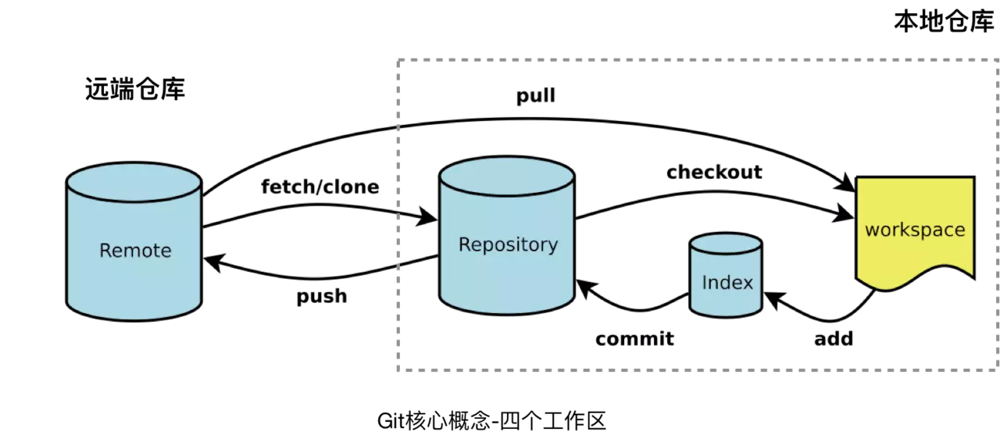
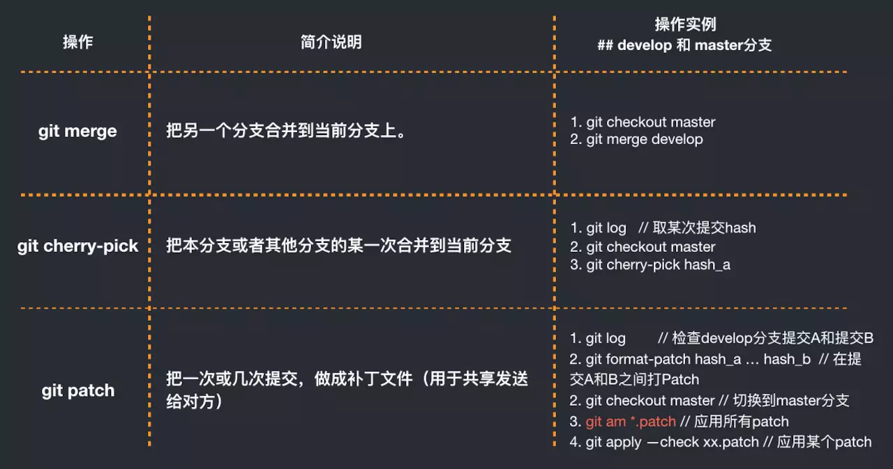

# Git核心概念及原理
Git 是分布式版本控制系统，SVN 是集中化版本控制系统。  
SVN缺点: SVN 集中化版本控制系统虽然能够令多个团队成员一起协作开发，但有时如果中央服务器宕机的话，谁也无法在宕机期间提交更新和协同开发。甚至有时，中央服务器磁盘故障，恰巧又没有做备份或备份没及时，那就可能有丢失数据的风险。  

## Git 四个工作区
Git 的文件操作原理都是基于 Workspace （工作区），Index / Stage （暂存区）, Repository （仓库区） 和 Remote（远程仓库）四个工作区来进行流转。

- Workspace工作区： 平时存放编辑项目代码的空间
- Index / Stage暂存区： 用于临时存放你的改动，事实上它只是一个文件，保存即将提交到文件列表信息
- Repository仓库区（或版本库）： 就是安全存放数据的位置，这里面有你提交到所有版本的数据。其中 HEAD 指向最新放入仓库的版本
- Remote远程仓库： 托管代码的服务器。例如 Github 的代码远端代码托管服务器
  
例如我们一次完整的提交 add --> commit --> push 经历的工作区变化就是  
工作区 --> 缓存区 --> 本地仓库区 --> 远端仓库

## 常用操作指令
git pull，git fetch， git pull --rebase

- git pull : git fetch + git merge
- git pull --rebase: git fetch + git rebase

## Git高阶操作(黑科技)
merge, cherry-pick和patch使用及差别

## 强制更新，慎用
git push origin master --force  // 强制push本地正确的版本，但是慎用。因为它是不可逆转的

## revert 和 reset区别

有些时候开发者需要退回到某次正确的提交记录，有些时候开发者的commit错误了，这时候可以使用 git revert 和 git reset。

- git revert： 撤销某次操作，此次操作之前的commit都会被保留。
- git reset ： 撤销某次提交，但是此次之后的修改都会被退回到暂存区。

